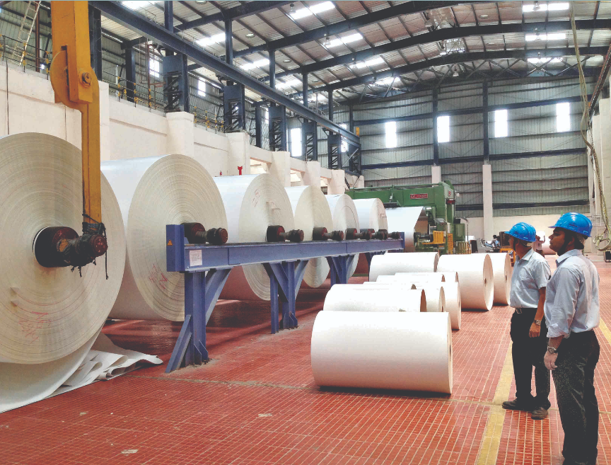
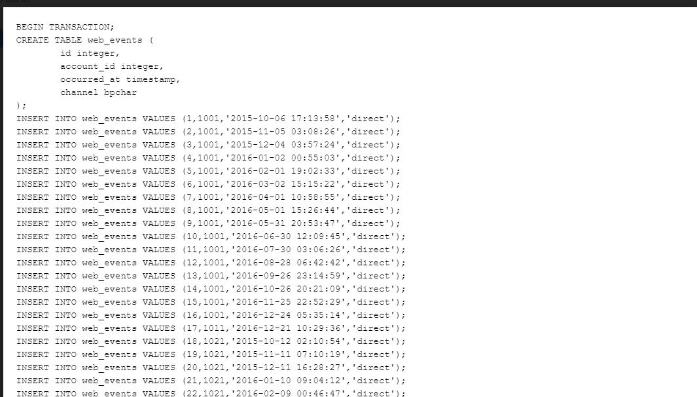
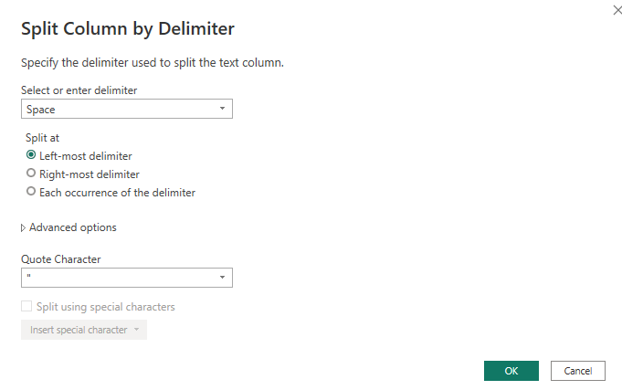
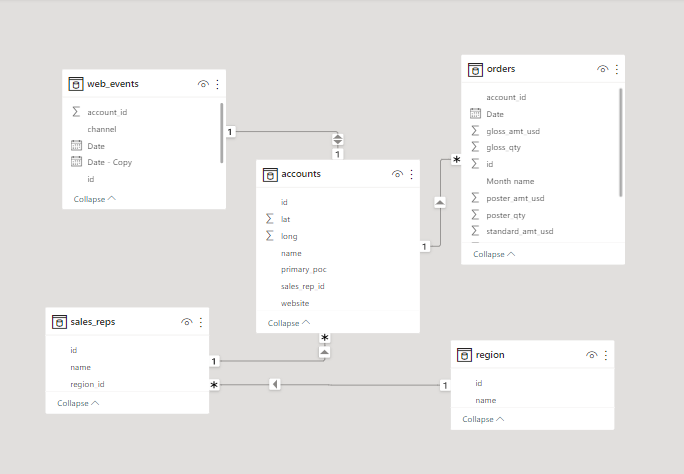
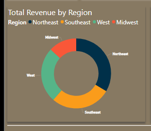

# Parch-and-Posey Analysis

## Introduction

**Parch and Posey** is a company that deals with the sale of three distinct paper types to ir clients. The Parch and Posey dataset contains 5 tables with varying number of columns, all linking via primary keys and foreign keys. Each contains important information on customers, their orders and its characteristics, their purchase regions, assigned sales representatives and the route from which they were integrated into the company. The tables include **accounts, orders, region, sales_reps and web_events**.

**_Disclaimer_** : _The dataset used and its application case are fictional, however, they mirror real life scenarios and problems which can be faced by real life data analyst in real life companies._

## Problem Statement
1.	To check for the total revenue for each region.
2.	The total revenue by month trend.
3.	Their top 10 and bottom 10 customers.
4.	The top performing sales_reps in the company generally.
5.  Any other relevant data-driven insight into our sales.

## Data Sourcing
As a newly employed data analyst, i was allowed to access the company’s database (using SQL), i went ahead to get the data and downloaded the file, and extracted it into Power BI for cleaning, analysis and visualization.

It contains 5 tables:

  1. accounts with 7 columns and 351 rows
  2. orders with 13 columns and 6912 rows
  3. region with 2 columns and 4 rows
  4. sales_reps  with 3 columns and 50 rows
  5  web_events 7 rows and 9073 rows
  
## Data Transformation/Cleaning:

Data was officially cleaned and transformed with the Power Query Editor of Power Bi. Some of the applied steps includes:

  . Split columns by delimiter of the web-events and the order table to have sperate data and time into different columns after that the columns was renamed to **date     and time**.
  
  . The sales-rep and accounts columns were filtered to check and fix of errors, duplicates and blanks.
  
  . The Region table was free from all abnormality.
  
  
  
## Data Modelling

Power Bi automatically generate relationships between the different tables

## Data Analysis and Visualization

  1. The total revenue generated from 2013 - 2017 was $23M, this can also be filted by year to see revenue for each year.
  
  2. The total revenue by month trend shows that revenue was highest in December ($3.13M) followed by November (2.39M). February and January Produced the lowest revenue (1.31M, 1.34M) respectively.
  
  3. At $1,098,138, Earlie Schleusner who is a sales rep had the highest Total Revenue and 174,430 quantity of products ordered followed by Tia Amato with a revenue of $1,010,691 and 152,638 quantity of products.
  
  
  
  Northeast region generated the highest revenue.
  
## Conclusions and Recommendations
  
    . The total revenue by month trend shows that revenue was highest in December ($3.13M) followed by November (2.39M). February and January Produced the lowest revenue (1.31M, 1.34M) respectively. More Adverts and Promotions should be made in these months to enable increase in revenue.
    
    . Across all 4 regions, Northeast has the highest product ordered quantity which is the Standard paper 646871, this same product has the highest quantity ordered, from the 3 rest regions Southeast, West and Midwest respectively. The Midwest has the least product ordered which is the Poster paper with 83377 quantity ordered. The company should make available the Standard paper more in the 4 regions and more sales rep can also be considered for employment to help to generate more income. 
  
    . At $1,098,138, Earlie Schleusner who is a sales rep had the highest Total Revenue and 174,430 quantity of products ordered followed by Tia Amato with a revenue of $1,010,691 and 152,638 quantity of products. Rewards, commission and Bonues should be awarded and given for employees hard work. This will encourage others to do more. 
  
    . EOG Resources is the company's highest customer followed by Mosaic and the least is Nike. Customer appreciation package should be encouraged.
  
You can reach me [Twitter](https://twitter.com/vicky_star0)
  
Kindly leave your feedback and suggestions
  

